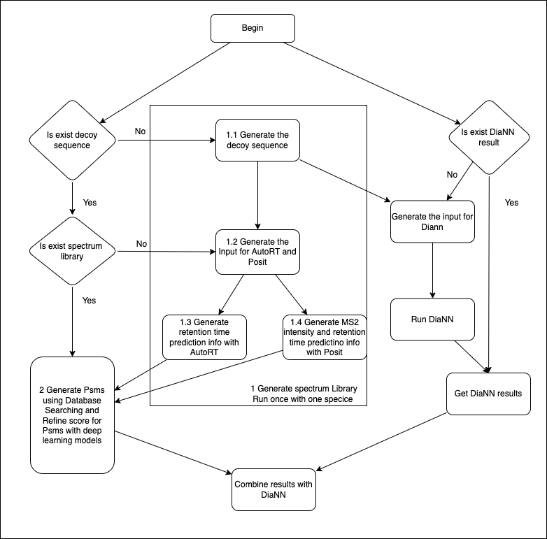

# LooMS
Java + Python + R framework for working with DIA data.

### Quickstart:  
These instructions are specified for Ubuntu.  

* [IntelliJ IDE Installation](https://www.jetbrains.com/idea/download/)  
Download and install the IDE. The Community version is fine, but if you have a student email (uwaterloo email) you can sign up for the Ultimate version.

* [Java-1.8.0 JDK (linux)](https://openjdk.java.net/install/)  
Download and install Java JDK (if not already on system).    
`sudo apt-get install openjdk-8-jdk`

* [Apache Maven](https://maven.apache.org/install.html)  
Download and install Apache Maven.  
`sudo apt-get install maven`

* [Docker](https://docs.docker.com/engine/install/ubuntu/) & [Docker Compose](https://docs.docker.com/compose/install/)  
Download and install Docker.    
```
sudo apt-get update
sudo apt-get install -y apt-transport-https ca-certificates curl software-properties-common
curl -fsSL https://download.docker.com/linux/ubuntu/gpg | sudo apt-key add - 
sudo add-apt-repository \
   "deb [arch=amd64] https://download.docker.com/linux/ubuntu \
   $(lsb_release -cs) \
   stable"
sudo apt-get update
sudo apt-get install docker-ce

sudo groupadd docker
sudo usermod -aG docker $USER
```  
Reboot your computer to apply the new group permissions at this point.  
Install Docker-Compose.  
```
sudo curl -L "https://github.com/docker/compose/releases/download/1.27.4/docker-compose-$(uname -s)-$(uname -m)" -o /usr/local/bin/docker-compose

sudo chmod +x /usr/local/bin/docker-compose
```

<hr>  

### Code Setup
Clone & navigate to the repository.
```
git clone git@github.com:LooMS/dia_data_reading.git
cd dia_data_reading/

# Change branches to develop
git fetch --all
git checkout -b develop

# Compile the project
make
```

Structure at dia_data_reading/ should look like the following:  
```
dia_data_reading/
└───.github/workflows/
└───data/
└───autort/
└───ext_lib/
└───figures/
└───scripts/
└───src/
│   └───main/
│      └───java/edu/uw/LooMS/
│      └───python/
│      └───R/
│      └───resources/
│   └───test/
.dockerignore
.gitignore
Dockerfile
Makefile
docker-compose.yml
pom.xml
readme.md
```

Your data files should be located in the *data/* folder.  
By default, the program will execute on the *toy.mzXML* file located in *dia_data_reading/data/*.  
JAVA source files should go under *dia_data_reading/src/main/java/edu/uw/LooMS/*.  
PYTHON source files should go under *dia_data_reading/src/main/python/*.
R source files should go under *dia_data_reading/src/main/R/*.


### Acquiring New Data  
Specify your LOCAL_DIR as necessary to where you cloned dia_data_reading/  
Navigate to that directory.  
```
LOCAL_DIR="/LooMS/"
PROJECT_DIR="dia_data_reading/"

cd $LOCAL_DIR$PROJECT_DIR
```  
Make a directory in data/ for your project.  
`mkdir data/PXD005573/`  

Download the RAW and FASTA files you wish to analyze.  
```
wget -P data/PXD005573/ ftp://ftp.pride.ebi.ac.uk/pride/data/archive/2017/10/PXD005573/Fig1_MP-DIA-120min-120kMS1-10W30k-14dppp_MHRM_R01.raw
wget -P data/PXD005573/ ftp://ftp.pride.ebi.ac.uk/pride/data/archive/2017/10/PXD005573/uniprot_sprot_2014-12-11_HUMAN_ISOFORMS.fasta
```

Convert the data set to mzXML with centroiding & change owner to HOST USER:GROUP.  
```
docker run -it -v $PWD/data/PXD005573:/data chambm/pwiz-skyline-i-agree-to-the-vendor-licenses:x64 wine msconvert --zlib --filter "peakPicking true 1-" --mzXML /data/Fig1_MP-DIA-120min-120kMS1-10W30k-14dppp_MHRM_R01.raw
docker run -it -v $PWD/data/PXD005573:/data chambm/pwiz-skyline-i-agree-to-the-vendor-licenses:x64 chown $(id -u ${USER}):$(id -g ${USER}) Fig1_MP-DIA-120min-120kMS1-10W30k-14dppp_MHRM_R01.mzML
```  
<hr>

### Production Usage  
In order to use the app in production, you must satisfy 2 conditions:  
<ol>
<li>Be a part of the LooMS GitHub team.</li>  
<li>Create a PAT on GitHub, instructions as follows:</li>
</ol> 

[GitHub PAT](https://docs.github.com/en/free-pro-team@latest/github/authenticating-to-github/creating-a-personal-access-token)  

```
# Set your PAT in the console.
export CR_PAT=INSERT_YOUR_PAT_TOKEN_FROM_GITHUB_HERE

# Log in to docker with your CR_PAT. Remember to specify YOUR_GITHUB_USERNAME
echo $CR_PAT | docker login docker.pkg.github.com -u YOUR_GITHUB_USERNAME --password-stdin

# Navigate to the directory where your .mzXML, .fasta, and *.param files are.
docker run -it -v $PWD:/data docker.pkg.github.com/LooMS/dia_data_reading/LooMS:$TAG java -jar /LooMS/LooMS.jar -mzXML /data/dia_data.mzXML -detectionParams /data/featuredetect.params -selectionParams /data/featureselect.params -fasta /data/database_withdecoy.fasta
```


### LooMS Logical Flow


### 1 Generate Spectrum Library (Run once with one specie) 

#### 1.1 Generate the target and decoy protein sequences using target sequence 
```
java -Xmx96g -cp  /LooMS/LooMS.jar edu.uw.LooMS.GenerateTargetDecoyFastaFile <YourFastaFile>.fasta
# example:
java -Xmx96g -cp  /LooMS/LooMS.jar edu.uw.LooMS.GenerateTargetDecoyFastaFile uniprot-compressed_true_download_true_format_fasta_query__28_28taxon-2022.08.24-16.43.38.44.fasta
```

You can get a new fasta file as input for both our DIA data analysis and DiaNN analysis:
named <YourFastaFile>_1Target3DecoyFiles.fasta, that combine one target sequences and three decoy sequences.
named <YourFastaFile>_1DecoyR1TargetForDiann.fasta, that combine one decoy sequences +'R'+target sequences without first char.


#### 1.2 Generate the input for AutoRT and Prosit
```
java -Xmx96g -cp  /LooMS/LooMS.jar edu.uw.LooMS.GenerateAutoRTAndPrositInputFile <YourFastaFile>.fasta  <YourmzXMLFile>.mzXML
# example:
java -Xmx96g -cp  /LooMS/LooMS.jar edu.uw.LooMS.GenerateAutoRTAndPrositInputFile uniprot-compressed_true_download_true_format_fasta_query__28_28taxon-2022.08.24-16.43.38.44.fasta Fig4_mouse_cerebellum_MHRM_R02_T0.mzXML
```
You can get two csv files as input file for AutoRT and Prosit to generate the specturm library, named <YourFastaFile>_forAutoRT.csv and <YourFastaFile>_forProsit.csv respectively.


#### 1.3 Generate specturm library by using AutoRT 
```
#run AutoRT (autoRT has integerated in our docker)
cd /autort/AutoRT
mkdir <AutoRTResultDirectory>
python autort.py predict -t  <YourFastaFile>_forAutoRT.csv -s ../tf_model/model.json -o <AutoRTResultDirectory> -p test
cp <AutoRTResultDirectory>/test.tsv /data/<AutoRTResultFile>

# example:
cd /autort/AutoRT
mkdir mouseR02
python autort.py predict -t  /data/uniprot-compressed_true_download_true_format_fasta_query__28_28taxon-2022.08.24-16.43.38.44_1Target3DecoyFiles_forAutoRT.csv -s ../tf_model/model.json -o mouseR02 -p test
cp mouseR02/test.tsv /data/mouseR02_autortResult.tsv


```
more information about AutoRT, please see 
https://github.com/bzhanglab/AutoRT

#### 1.4 Generate specturm library by using Prosit (all steps are not executed in LooMS docker)
more information about Prosit, please see
https://github.com/kusterlab/prosit
download Prosit
You can download pre-trained models for HCD fragmentation prediction and iRT prediction on https://figshare.com/projects/Prosit/35582.

```
#copy msb.py to <yourPrositPath>/prosit/converters/
cp msb.py <yourPrositPath>/prosit/converters/
```
msb.py can be found in /src/main/python/

```
#run Prosit

make server MODEL_SPECTRA=<yourPrositPath>/prosit/fragmentation_model/ MODEL_IRT=<yourPrositPath>/prosit/irt_model/

curl -F "peptides=@<YourFastaFile>_forProsit.csv" http://127.0.0.1:5000/predict/msp >  <yourPrositResultFile>

#copy <yourPrositResultFile> to <directory of PrositResult>

#stop the Prosit docker to release the GPU resources
docker stop <PrositDockerContainerID> 

#example:
cd ~/tools/prosit/

make server MODEL_SPECTRA=./fragmentation_model/ MODEL_IRT=./irt_model/
curl -F "peptides=@/data/uniprot-compressed_true_download_true_format_fasta_query__28_28taxon-2022.08.24-16.43.38.44_1Target3DecoyFiles_forProsit.csv" http://127.0.0.1:5000/predict/msp >  prositMouseR02Result12051t3d.txt

mkdir ~/data/mourseR02/prosit
cp prositMouseR02Result12051t3d.txt to ~/data/mourseR02/prosit

docker ps
docker stop <prositContainerID>
```


### 2 Generate PSMs using Database Searching and Refine score for PSMs with deep leaning models
```
  cd <yourDataPath>
  #check the proteinSequence file that contain target protein sequences and 3 times decoy protein sequences as its corresponding target 
  #check the mzXML that extracted from Raw file
  #check the AutoRT result file
  #check the Prosit files in the <prositDir>
  docker run -v $PWD:/data -v /var/run/docker.sock:/var/run/docker.sock -v /usr/bin/docker:/usr/bin/docker -it looms-refactor0824  /bin/bash
  java -jar -Xmx96g /LooMS/LooMS.jar -mzXML <yourmzXMLfile>.mzXML -fasta <TargetAndDecoyProteinSequencesGeneratedby2.1>.fasta -autort <AutoRTResultFile Generated by 2.3>  -prositDir <directory of PrositResultFile Generated by 2.4>
```
example:
```
#run in LooMS docker
  docker ps
  docker attach <LooMS containerID>
  java -jar -Xmx96g /LooMS/LooMS.jar -mzXML /data/Fig4_mouse_cerebellum_MHRM_R02_T0.mzXML -fasta /data/concat-MQ-e1k2DBD-uniprot-compressed_true_download_true_format_fasta_query__28_28taxon-2022.08.24-16.43.38.44_1targetVS3Decoy.fasta  -autort mouseR02_autortResult.tsv -prositDir /data/prosit/ 
```


